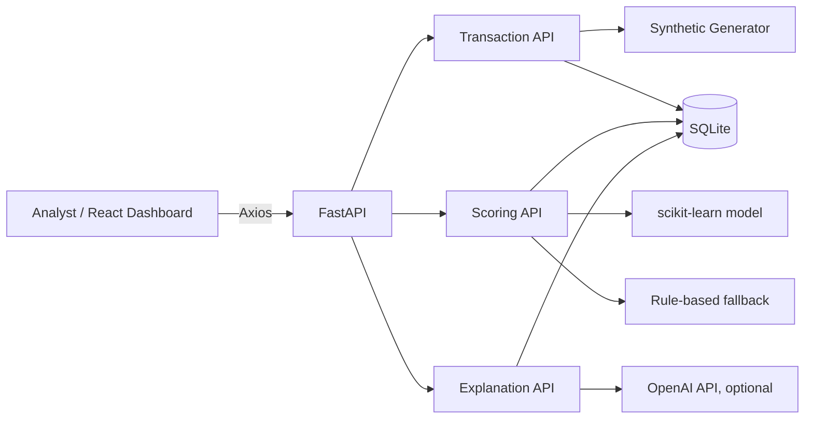
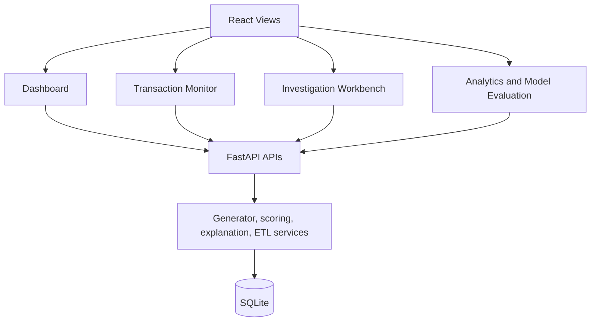
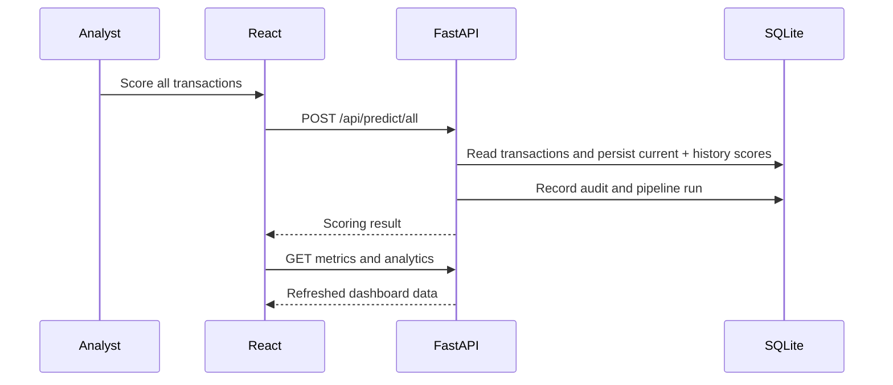

# AI-Powered Credit Card Fraud Detection Platform

A full-stack fraud risk operations platform that generates or imports card activity, scores risk with a rule-based or scikit-learn model, and gives analysts an explainable investigation workflow. Teams can generate data, upload their own transaction CSV, score a queue, review risk trends, and request a decision explanation.

> This project deliberately uses synthetic data first. A real fraud dataset can be integrated later without changing the API or analyst workflow.

## What It Demonstrates

- FastAPI REST APIs, SQLite persistence, SQLAlchemy models, and environment-based configuration.
- Synthetic transaction generation and a model-serving fallback when no trained artifact exists.
- React/Vite dashboard with batch scoring, sortable and filterable transaction triage, risk badges, charts, loading skeletons, and investigation views.
- Optional OpenAI-powered analyst explanations that explain a completed score without making the fraud decision.
- Docker Compose setup with secrets loaded from an ignored backend `.env` file.

## Architecture



## Portfolio Features

- Generate and persist synthetic card transactions.
- Score individual records or the full transaction queue using `POST /api/predict/all`.
- Present LOW, MEDIUM, and HIGH risk in accessible green, orange, and red badges.
- Visualize fraud versus legitimate predictions and risk distribution from latest scores.
- Filter by risk, country, and merchant category; sort transaction columns in either direction.
- Explain a selected prediction locally or through OpenAI when `OPENAI_API_KEY` is configured.
- Persist prediction history, investigation decisions, audit events, data-quality runs, pipeline status, and model-run metadata.
- Monitor country/category volume and daily fraud trends; export a filtered transaction queue to CSV.

## Component and Request Flow





## Project Structure

```text
fraud-detection-platform/
|-- backend/                 FastAPI app, ML pipeline, SQLite models
|-- frontend/                React/Vite analyst dashboard
|-- screenshots/             Portfolio screenshot placeholders
|-- docker-compose.yml
`-- README.md
```

## Quick Start

### Backend

```powershell
cd backend
python -m venv .venv
.\.venv\Scripts\Activate.ps1
pip install -r requirements.txt
Copy-Item .env.example .env
python -m app.ml.train
uvicorn app.main:app --reload
```

The API runs at `http://localhost:8000`. The model-training command is optional; without `model.joblib`, scoring uses transparent rules.

### Frontend

```powershell
cd frontend
Copy-Item .env.example .env
npm install
npm run dev
```

The dashboard runs at `http://localhost:5173`. `VITE_API_URL` defaults to `http://localhost:8000` and can be changed in `frontend/.env`.

## Data Modes

### Synthetic Data Mode

Use **Generate transactions** in Transaction Monitor or **Generate and score batch** in Risk Overview to create realistic synthetic transaction records. This is the default mode and needs no external dataset.

### CSV Upload Mode

Use **Upload CSV** in Transaction Monitor to import your own transaction records. Download **CSV template** first for an example with the correct headers. The import is atomic: if any row is invalid, no rows are stored and the UI lists the failing rows.

Required CSV columns:

```text
amount,merchant_category,country,hour_of_day,is_weekend,device_type,transaction_velocity
```

Optional columns:

```text
transaction_id,customer_id
```

When those optional identifiers are blank or omitted, the backend creates them. The product displays a human-readable transaction summary, while retaining `transaction_id` internally for APIs, scoring, and audit records.

Example row:

```csv
txn_example_001,cust_example_001,99.95,fuel,US,14,false,mobile,2
```

## Verification

After installing backend requirements, run the CSV integration test from `backend/`:

```powershell
python -m unittest tests.test_csv_upload
```

The test uploads a valid CSV, verifies generated IDs and the product-facing transaction summary, scores the imported transaction, confirms it appears in `GET /api/transactions`, and checks that an invalid CSV returns row-level validation errors.

### Docker

```powershell
Copy-Item backend\.env.example backend\.env
docker compose up --build
```

## Environment Variables

Backend values live in `backend/.env` and are never committed.

| Variable | Purpose | Default |
| --- | --- | --- |
| `OPENAI_API_KEY` | Enables hosted investigation explanations | blank, local explanation mode |
| `OPENAI_MODEL` | OpenAI model for explanations | `gpt-4.1-mini` |
| `DATABASE_URL` | SQLAlchemy connection string | `sqlite:///./fraud_detection.db` |
| `APP_ENV` | Runtime environment label | `development` |
| `DEBUG` | FastAPI debug mode | `true` |

The backend warns at startup when no OpenAI key is configured and continues in local explanation mode.

## API Endpoints

| Method | Endpoint | Description |
| --- | --- | --- |
| `GET` | `/health` | Service health and configuration mode |
| `POST` | `/api/transactions/generate` | Create synthetic records |
| `GET` | `/api/transactions` | List records with their latest prediction |
| `GET` | `/api/transactions/template` | Download an import-ready CSV template |
| `POST` | `/api/transactions/upload` | Validate and atomically import transaction CSV data |
| `POST` | `/api/predict` | Score one transaction by ID or payload |
| `POST` | `/api/predict/all` | Score every stored transaction |
| `GET` | `/api/metrics` | Return dashboard aggregates based on latest scores |
| `GET` | `/api/analytics` | Country, category, distribution, and daily trend data |
| `POST` | `/api/explain` | Return an analyst explanation for a score |
| `POST` | `/api/investigations/action` | Persist approve, review, or block action |
| `GET` | `/api/investigations/{id}/timeline` | View prediction and investigation history |
| `POST` | `/api/pipeline/validate` | Run raw record data-quality checks |
| `GET` | `/api/pipeline/runs` | View pipeline status history |
| `GET` | `/api/models/runs` | View model training runs and evaluation metrics |
| `GET` | `/ready`, `/version` | Readiness and build/model metadata |

## Screenshots

Add product-style screenshots for Risk Overview, Transaction Monitor, Case Investigation, Fraud Analytics, and Model Performance to [`screenshots/`](screenshots/). The folder is tracked so repository previews can be added without restructuring the project.

## Resume Bullets

- Built an AI-powered credit card fraud detection platform with FastAPI, React, SQLite, scikit-learn, and Docker, serving risk scores through documented REST APIs.
- Developed a synthetic data pipeline and dual-path fraud scorer that uses a trained model when available and transparent rules when no model artifact is present.
- Created an analyst dashboard with batch scoring, sortable and filterable transaction queues, risk visualizations, and OpenAI-assisted prediction explanations.
- Designed an environment-safe deployment workflow using `python-dotenv`, ignored secrets, local explanation fallback, and Docker Compose configuration.

## Future Improvements

- Integrate and validate against a real labeled fraud dataset.
- Add precision, recall, PR-AUC, calibration, and drift monitoring views.
- Move batch scoring to background jobs for larger data volumes.
- Add authentication, analyst roles, alert assignment, and case notes.
- Add automated frontend tests, backend test coverage, and CI.

## Lessons Learned

- A prediction table is not an audit log: current state and scoring history need separate storage.
- Explainability must describe a completed score, not silently become a second decision engine.
- SQLite and synchronous scoring are excellent local-demo defaults, but production batch jobs need a queue, a worker, and a managed database.
- Synthetic data enables product iteration; a real dataset requires an explicit schema contract, validation, evaluation, and governance process.

## GitHub Publishing

```powershell
git init
git add .
git commit -m "Build fraud detection portfolio platform"
git branch -M main
git remote add origin https://github.com/YOUR_USERNAME/fraud-detection-platform.git
git push -u origin main
```
